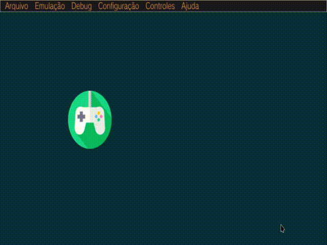

# vitajs

A way to develop games with Javascript on PS Vita.

Example script:

```javascript
const texture1 = Screen.load_png_file("app0:/assets/test1.png");

let pads = Pads; // Pads abd Screen are internals modules
let x = 200, y = 200;

let interval = os.setInterval(() => {
    if (pads.check(pads.UP))
        y -= 1;

    if (pads.check(pads.DOWN))
        y += 1;

    Screen.start_drawing()
    Screen.clear(0, 50, 50, 0) // format: r, g, b, a

    Screen.draw_texture(texture1, x, y) // draw our png

    Screen.end_drawing()
    Screen.swap_buffers()

    if (pads.check(pads.START)) {
        console.log('Closing app...\n'); // show the message on stdout
        os.clearInterval(interval); // it closes the app.
    }
}, 0);
```

2nd test: moving a PNG (Vita 3K)




1st test: hello world!


